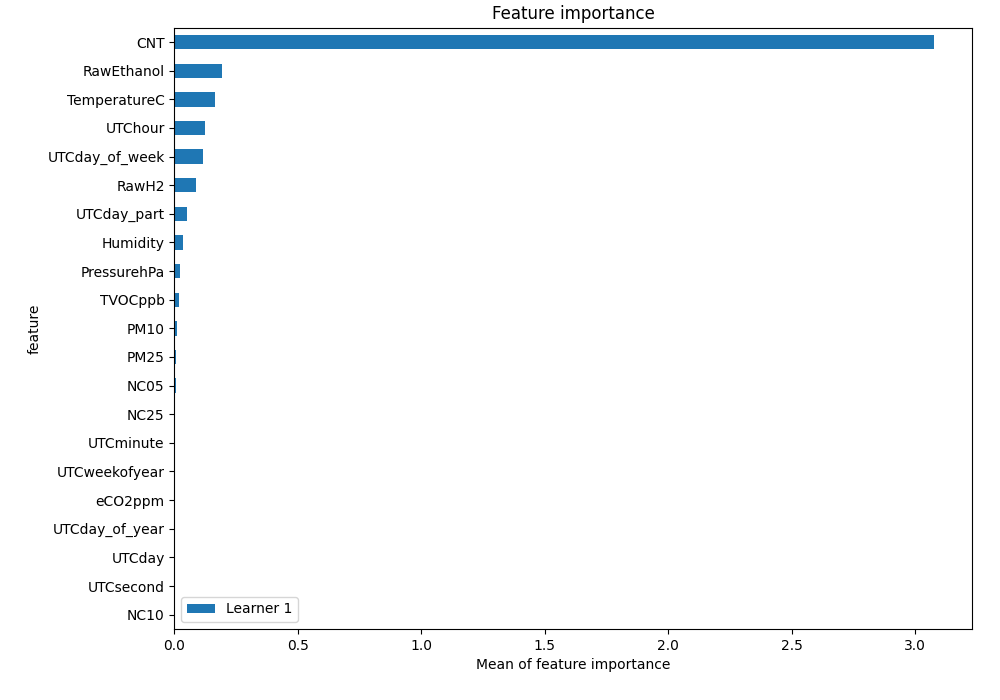
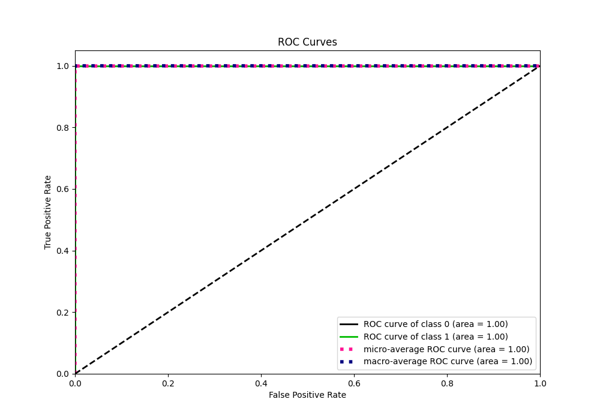
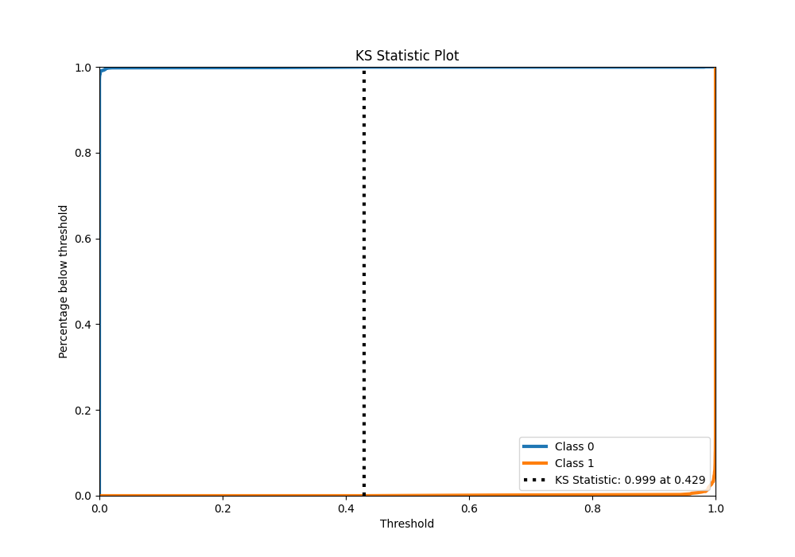
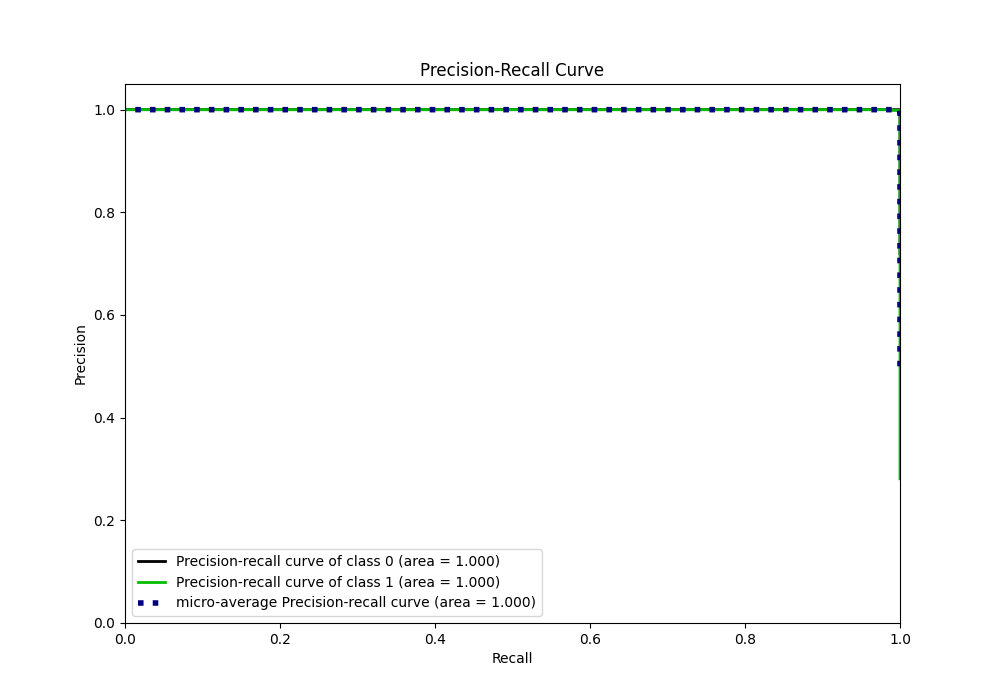
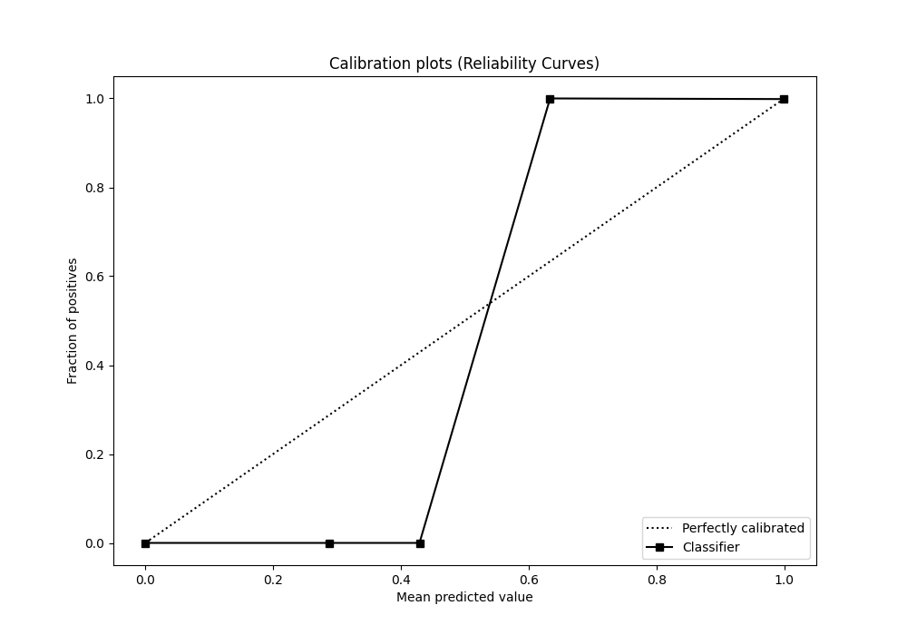
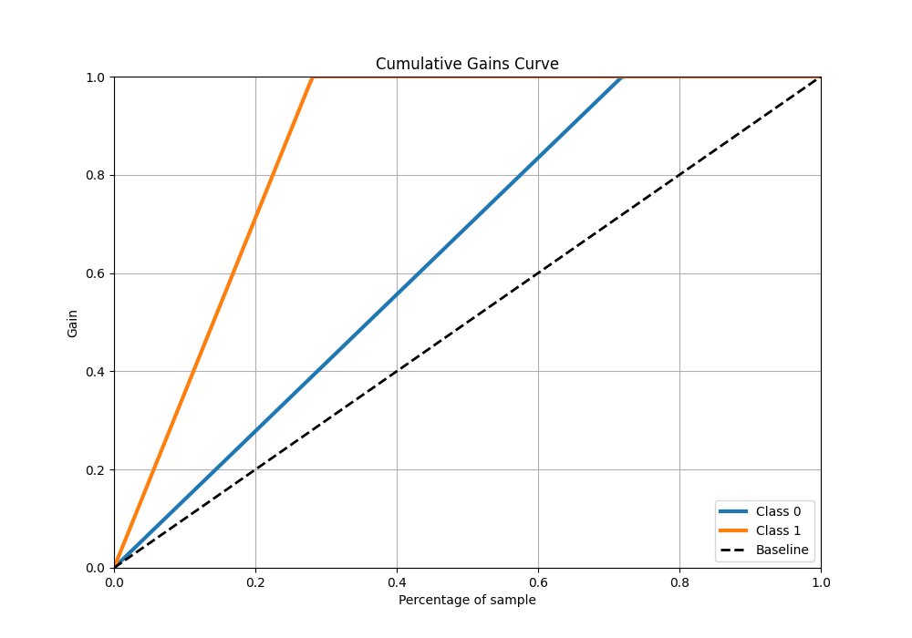
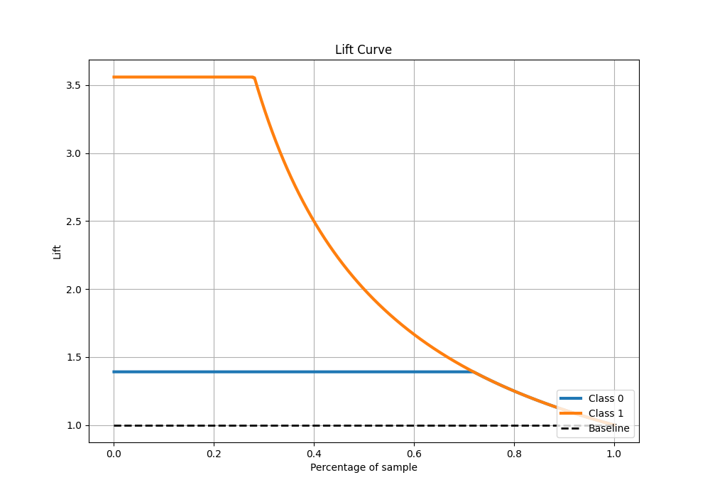

# Summary of 5_Default_NeuralNetwork

[<< Go back](../README.md)

## Neural Network
- **n_jobs**: -1
- **dense_1_size**: 32
- **dense_2_size**: 16
- **learning_rate**: 0.05
- **explain_level**: 2

## Validation
 - **validation_type**: split
 - **train_ratio**: 0.75
 - **shuffle**: True
 - **stratify**: True

## Optimized metric
logloss

## Training time

3.1 seconds

## Metric details
|           |      score |     threshold |
|:----------|-----------:|--------------:|
| logloss   | 0.00266932 | nan           |
| auc       | 0.999994   | nan           |
| f1        | 0.999285   |   0.500005    |
| accuracy  | 0.999598   |   0.500005    |
| precision | 1          |   1           |
| recall    | 1          |   3.34482e-30 |
| mcc       | 0.999006   |   0.500005    |

## Metric details with threshold from accuracy metric
|           |      score |   threshold |
|:----------|-----------:|------------:|
| logloss   | 0.00266932 |  nan        |
| auc       | 0.999994   |  nan        |
| f1        | 0.999285   |    0.500005 |
| accuracy  | 0.999598   |    0.500005 |
| precision | 0.998571   |    0.500005 |
| recall    | 1          |    0.500005 |
| mcc       | 0.999006   |    0.500005 |

## Confusion matrix (at threshold=0.500005)
|              |   Predicted as 0 |   Predicted as 1 |
|:-------------|-----------------:|-----------------:|
| Labeled as 0 |             1788 |                1 |
| Labeled as 1 |                0 |              699 |

## Learning curves

## Permutation-based Importance

## Confusion Matrix

## Normalized Confusion Matrix

## ROC Curve

## Kolmogorov-Smirnov Statistic

## Precision-Recall Curve

## Calibration Curve

## Cumulative Gains Curve

## Lift Curve

[<< Go back](../README.md)
