# Summary of 6_Default_RandomForest

[<< Go back](../README.md)

## Random Forest
- **n_jobs**: -1
- **criterion**: gini
- **max_features**: 0.9
- **min_samples_split**: 30
- **max_depth**: 4
- **eval_metric_name**: logloss
- **explain_level**: 2

## Validation
 - **validation_type**: split
 - **train_ratio**: 0.75
 - **shuffle**: True
 - **stratify**: True

## Optimized metric
logloss

## Training time

6.2 seconds

## Metric details
|           |     score |    threshold |
|:----------|----------:|-------------:|
| logloss   | 0.0160523 | nan          |
| auc       | 0.999978  | nan          |
| f1        | 0.99353   |   0.503451   |
| accuracy  | 0.996383  |   0.503451   |
| precision | 0.998555  |   0.503451   |
| recall    | 1         |   0.00171097 |
| mcc       | 0.991044  |   0.503451   |

## Metric details with threshold from accuracy metric
|           |     score |   threshold |
|:----------|----------:|------------:|
| logloss   | 0.0160523 |  nan        |
| auc       | 0.999978  |  nan        |
| f1        | 0.99353   |    0.503451 |
| accuracy  | 0.996383  |    0.503451 |
| precision | 0.998555  |    0.503451 |
| recall    | 0.988555  |    0.503451 |
| mcc       | 0.991044  |    0.503451 |

## Confusion matrix (at threshold=0.503451)
|              |   Predicted as 0 |   Predicted as 1 |
|:-------------|-----------------:|-----------------:|
| Labeled as 0 |             1788 |                1 |
| Labeled as 1 |                8 |              691 |

## Learning curves
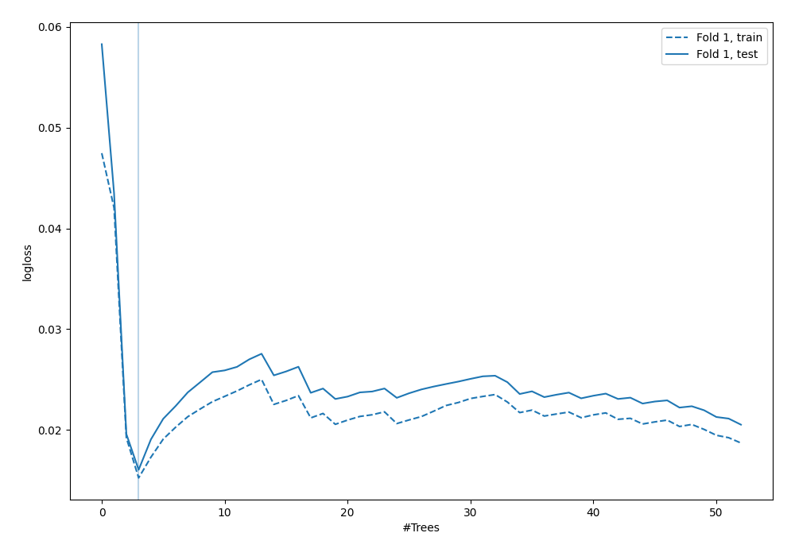

## Permutation-based Importance
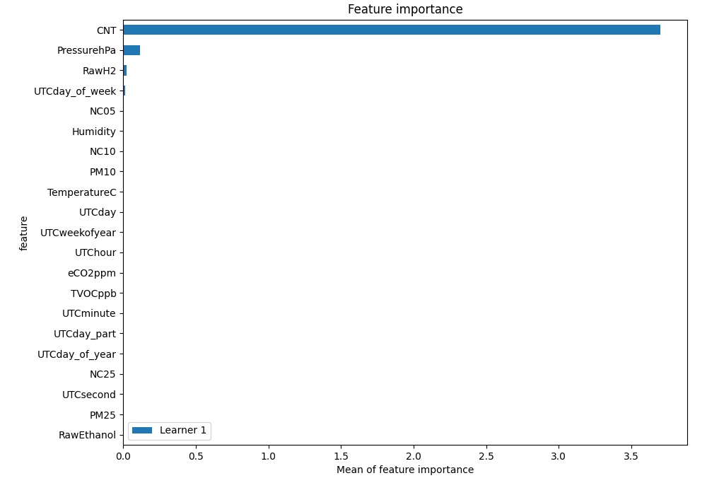
## Confusion Matrix

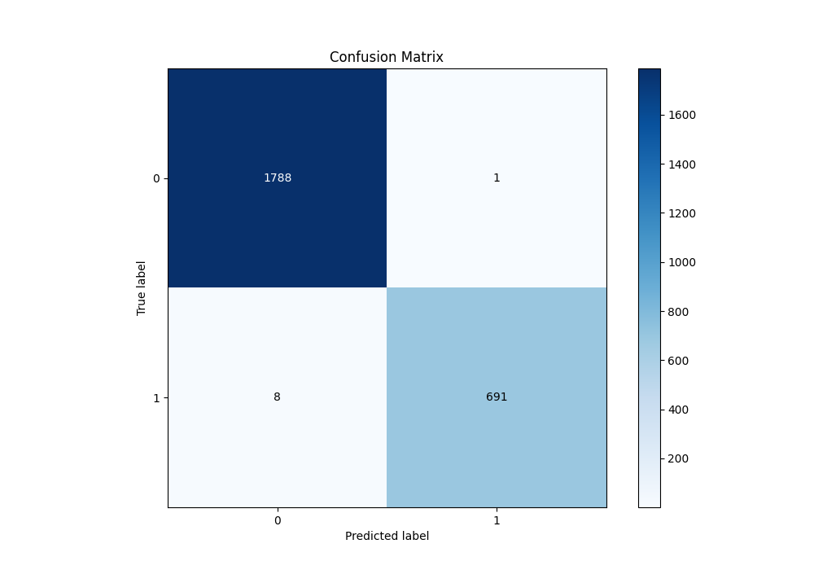

## Normalized Confusion Matrix

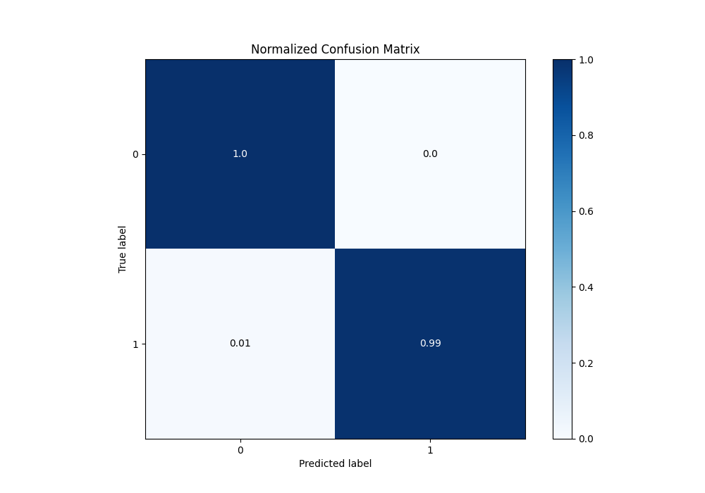

## ROC Curve

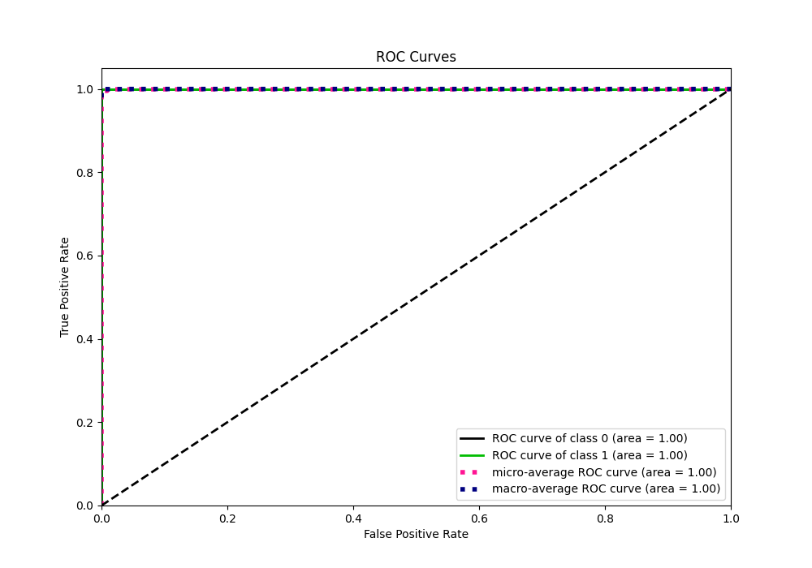

## Kolmogorov-Smirnov Statistic

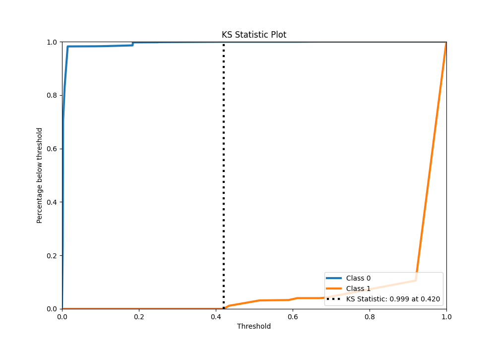

## Precision-Recall Curve

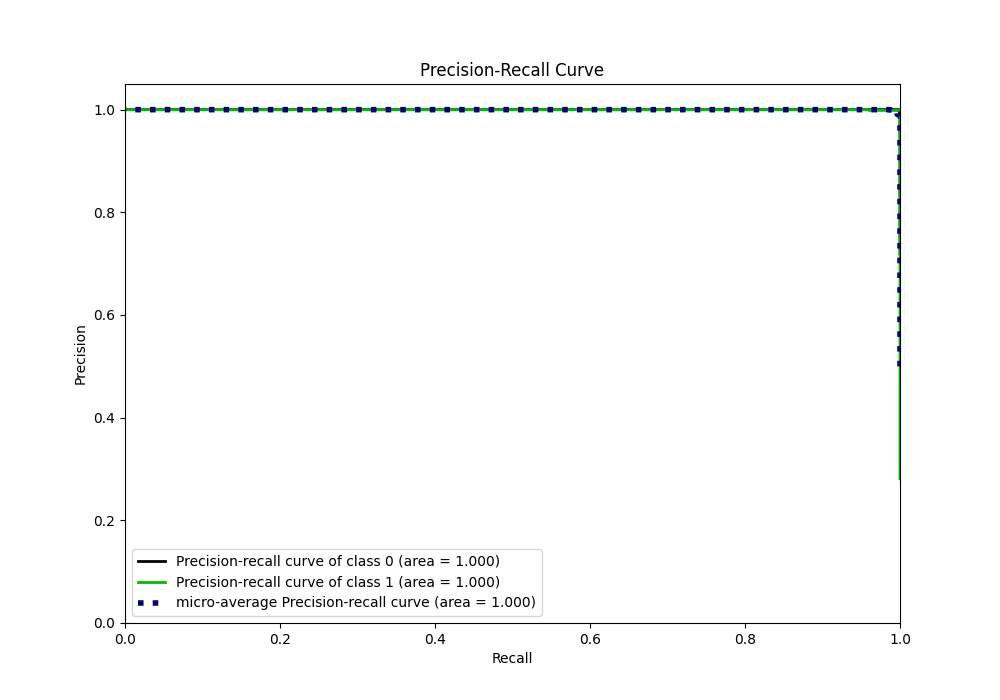

## Calibration Curve

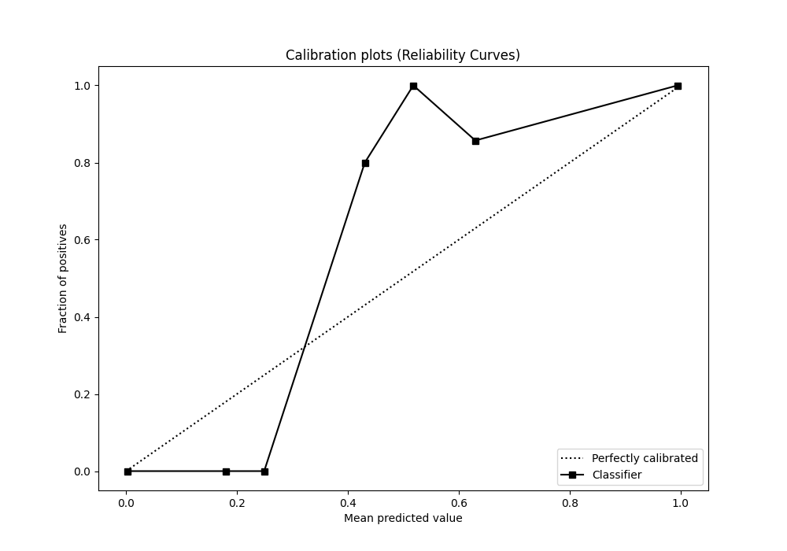

## Cumulative Gains Curve

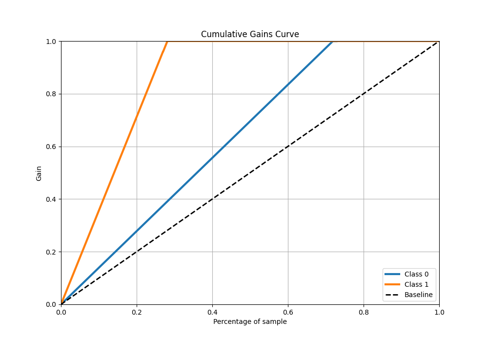

## Lift Curve

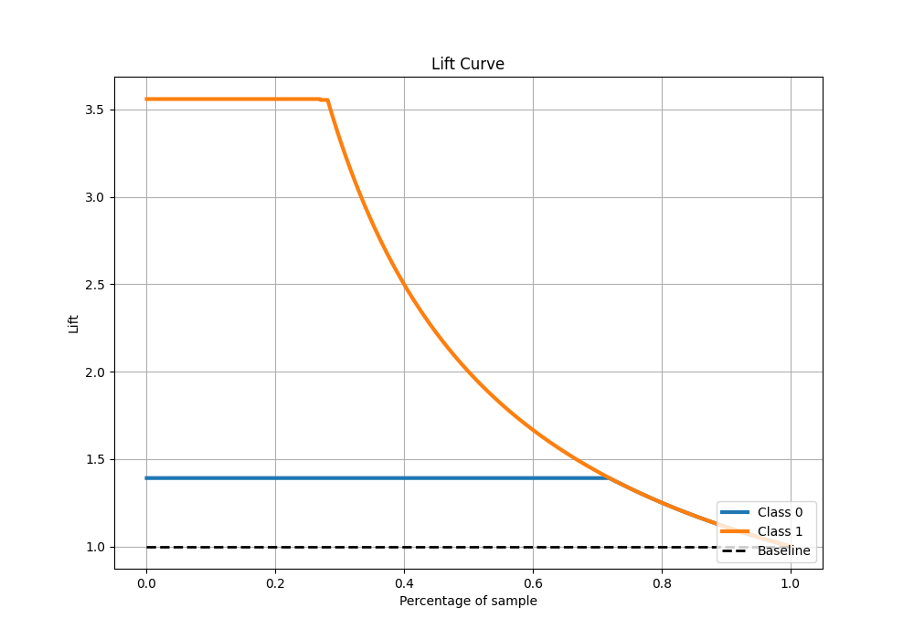

## SHAP Importance
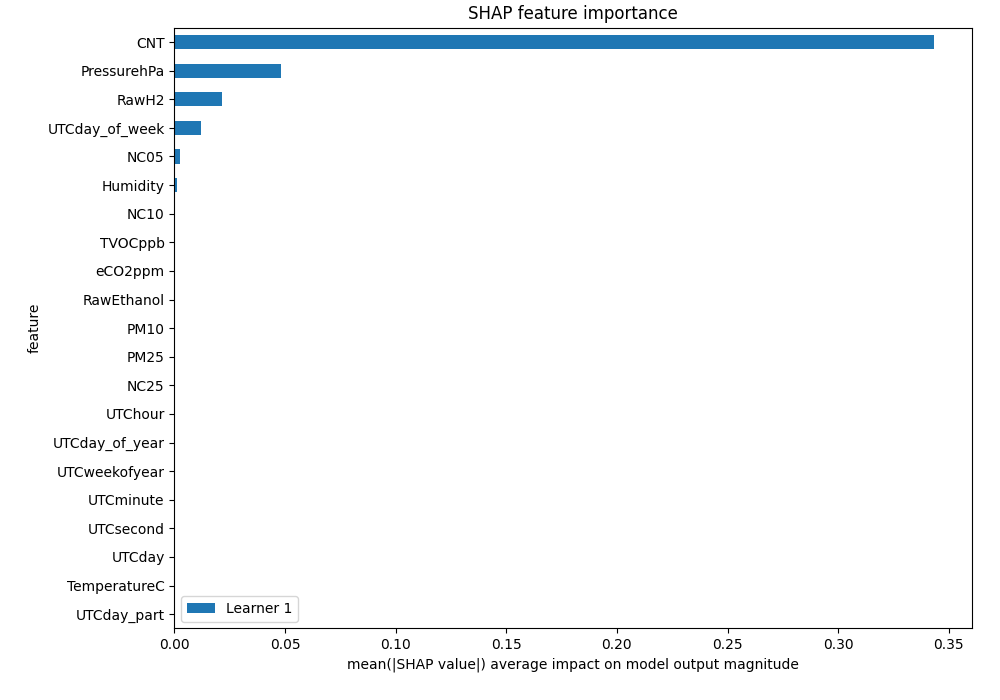

## SHAP Dependence plots

### Dependence (Fold 1)
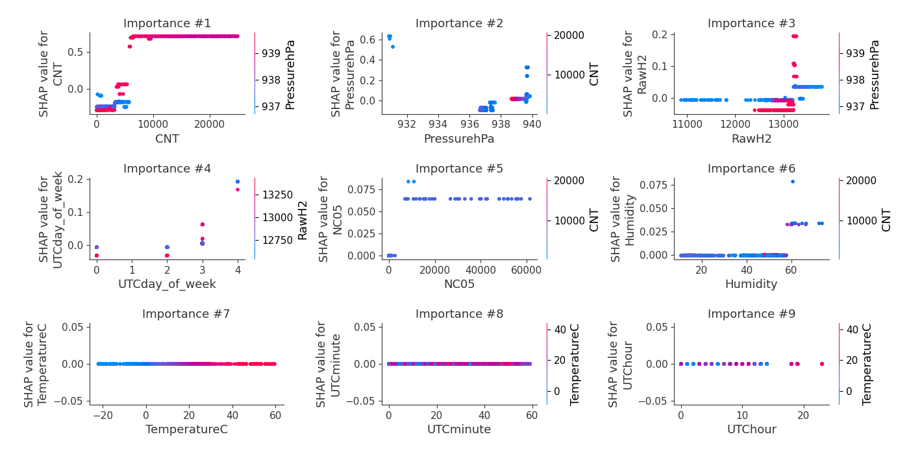

## SHAP Decision plots

### Top-10 Worst decisions for class 0 (Fold 1)
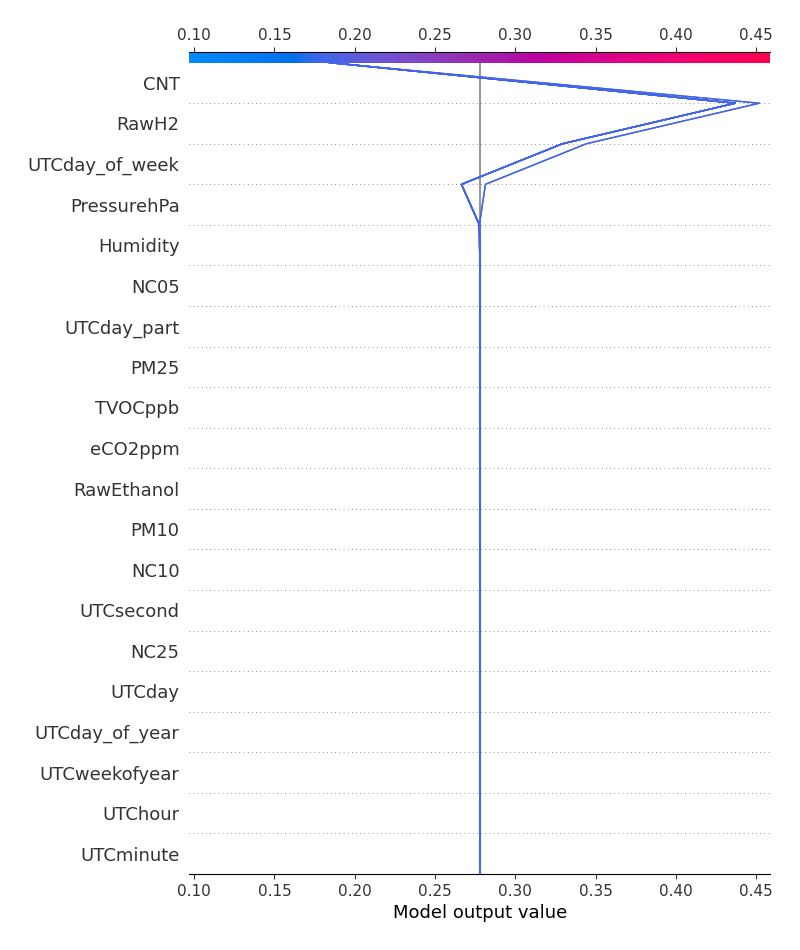
### Top-10 Best decisions for class 0 (Fold 1)

### Top-10 Worst decisions for class 1 (Fold 1)
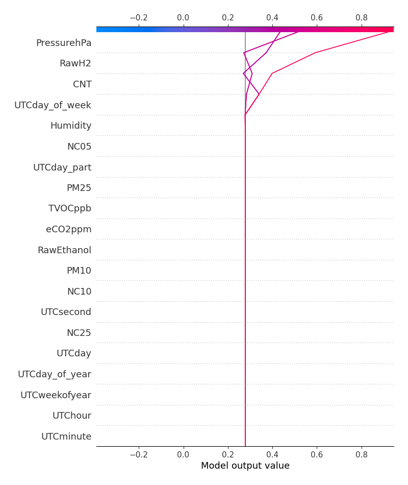
### Top-10 Best decisions for class 1 (Fold 1)
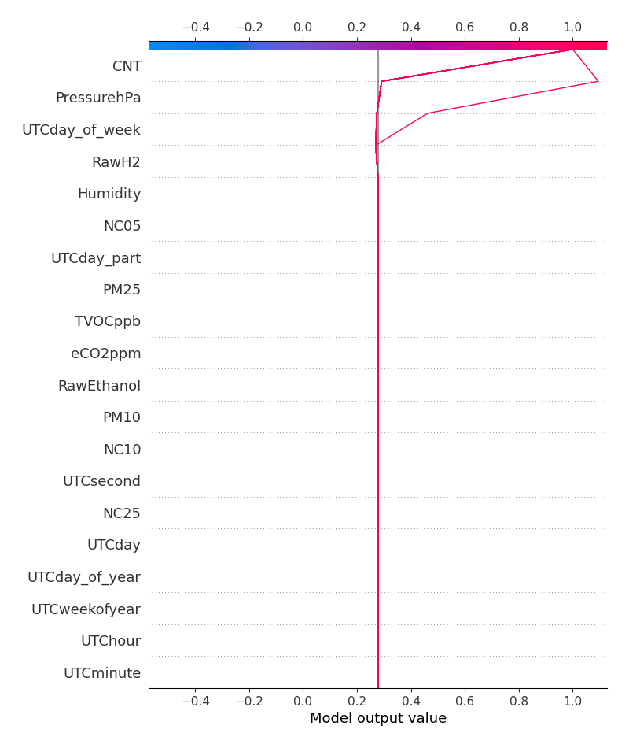

[<< Go back](../README.md)
