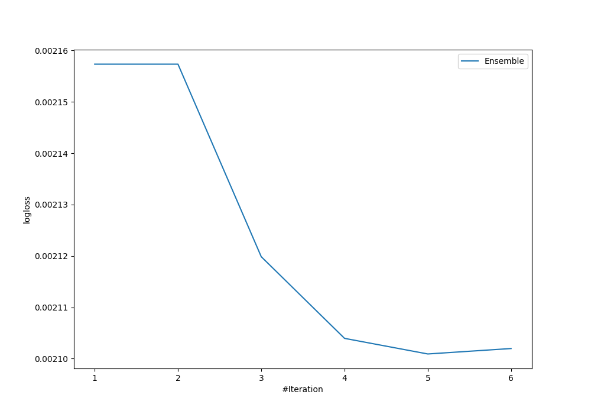
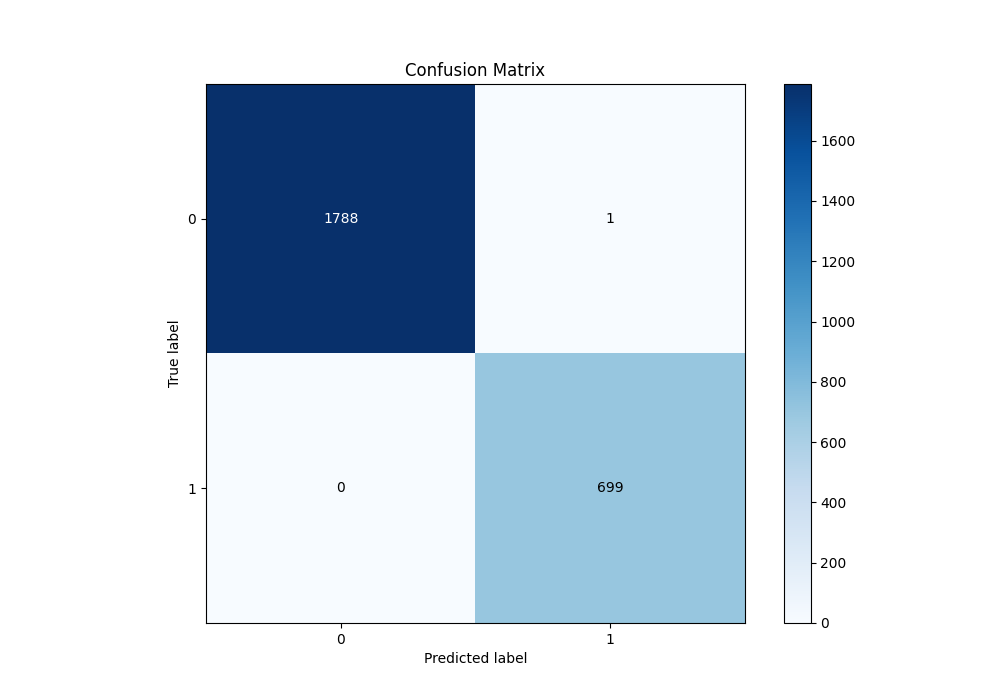
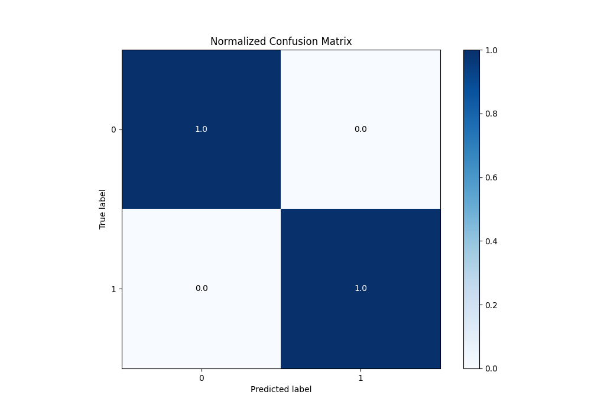
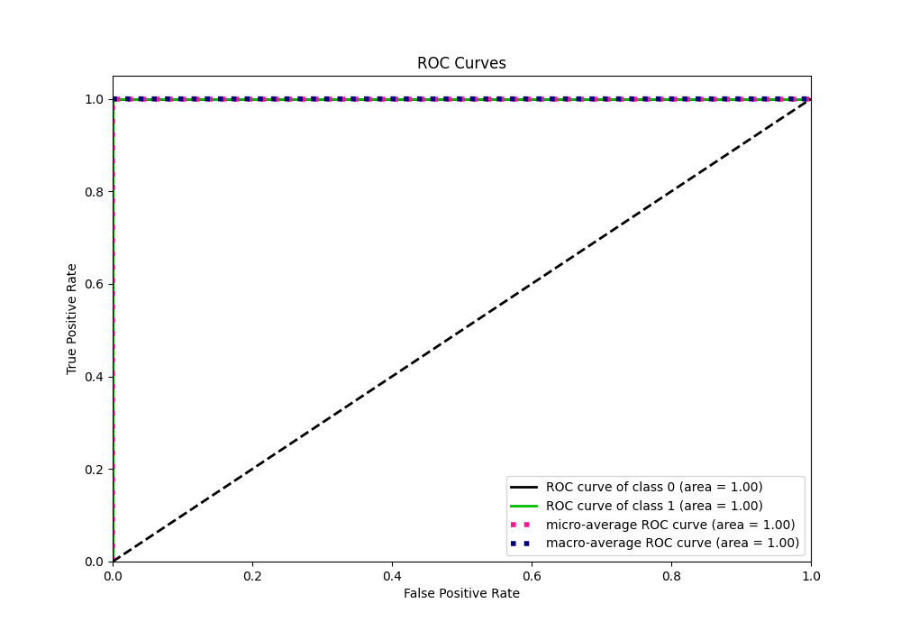
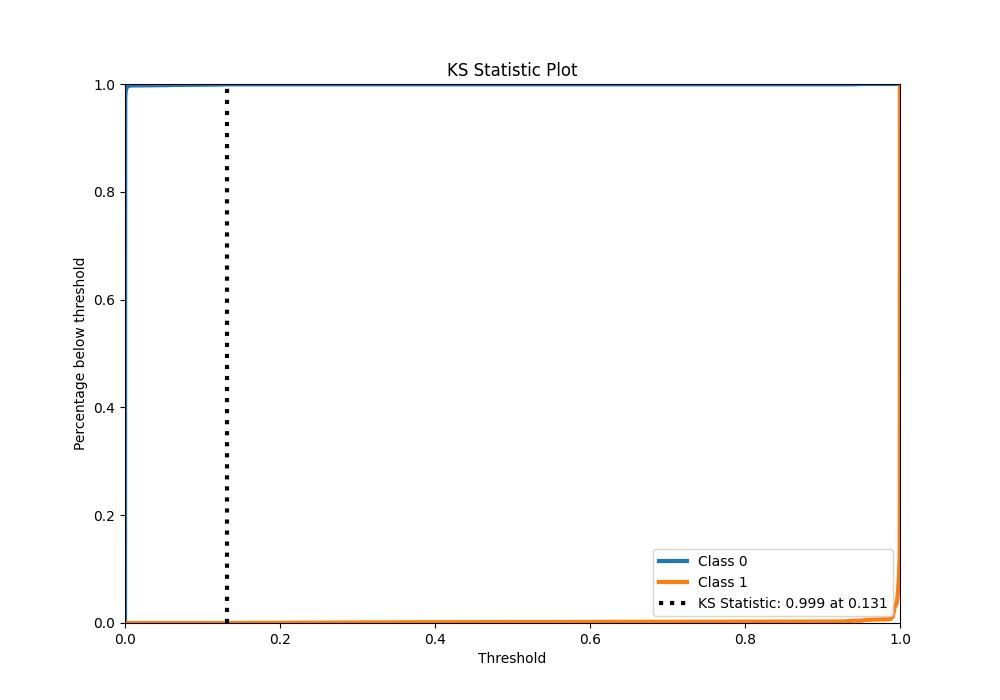
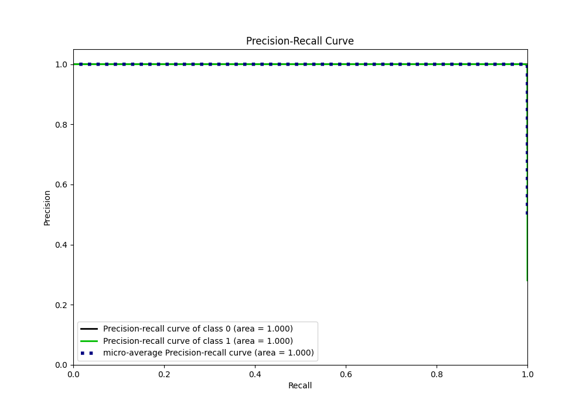
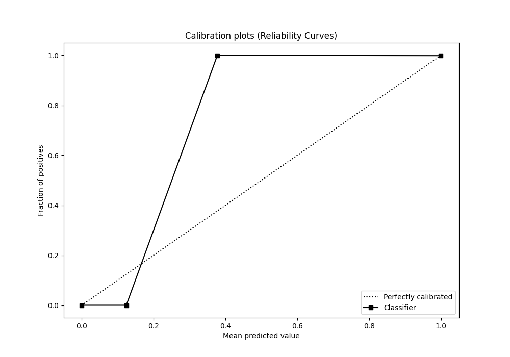
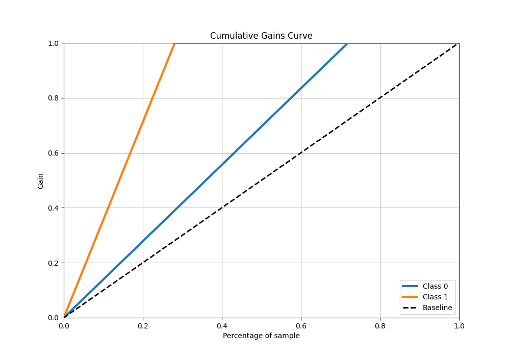
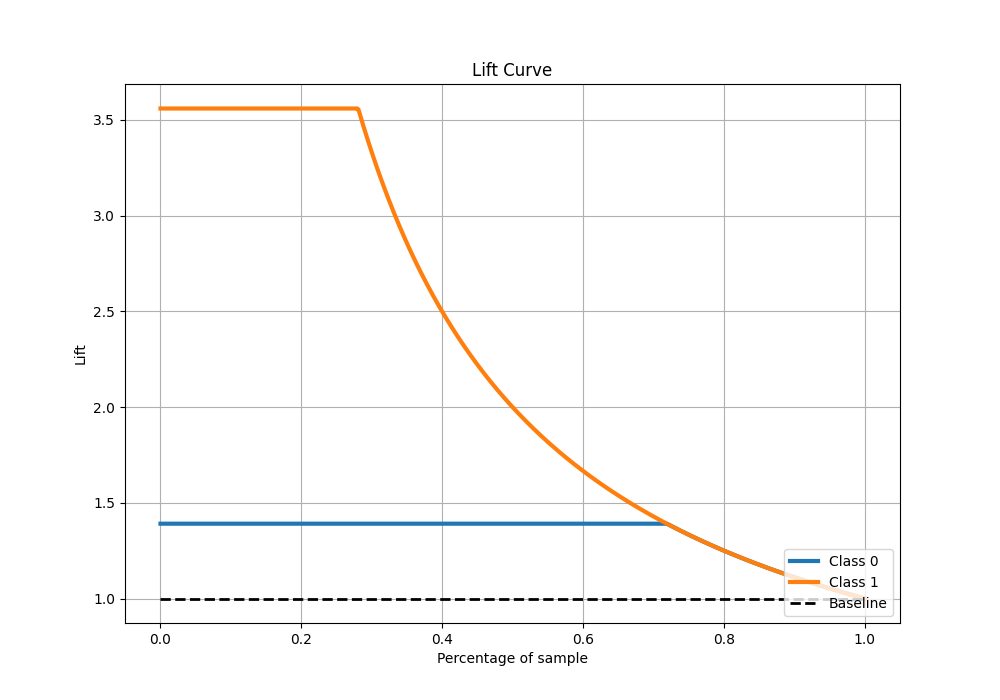

# Summary of Ensemble

[<< Go back](../README.md)

## Ensemble structure
| Model                   |   Weight |
|:------------------------|---------:|
| 4_Default_Xgboost       |        4 |
| 5_Default_NeuralNetwork |        1 |

## Metric details
|           |      score |     threshold |
|:----------|-----------:|--------------:|
| logloss   | 0.00210091 | nan           |
| auc       | 0.999998   | nan           |
| f1        | 0.999285   |   0.188872    |
| accuracy  | 0.999598   |   0.188872    |
| precision | 1          |   0.999855    |
| recall    | 1          |   5.61117e-05 |
| mcc       | 0.999006   |   0.188872    |

## Metric details with threshold from accuracy metric
|           |      score |   threshold |
|:----------|-----------:|------------:|
| logloss   | 0.00210091 |  nan        |
| auc       | 0.999998   |  nan        |
| f1        | 0.999285   |    0.188872 |
| accuracy  | 0.999598   |    0.188872 |
| precision | 0.998571   |    0.188872 |
| recall    | 1          |    0.188872 |
| mcc       | 0.999006   |    0.188872 |

## Confusion matrix (at threshold=0.188872)
|              |   Predicted as 0 |   Predicted as 1 |
|:-------------|-----------------:|-----------------:|
| Labeled as 0 |             1788 |                1 |
| Labeled as 1 |                0 |              699 |

## Learning curves

## Confusion Matrix

## Normalized Confusion Matrix

## ROC Curve

## Kolmogorov-Smirnov Statistic

## Precision-Recall Curve

## Calibration Curve

## Cumulative Gains Curve

## Lift Curve

[<< Go back](../README.md)
